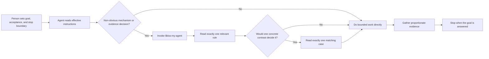

# KISS My Agent

**Keep It Simple, Scientist.**<br>
**Less ceremony. More science.**

[](LICENSE)


[English](README.md) · [简体中文](README.zh-CN.md) · [Installation](docs/INSTALLATION.md) · [Extending](docs/EXTENDING.md) · [FAQ](docs/FAQ.md) · [Contributing](CONTRIBUTING.md)

KISS My Agent is a compact, reusable instruction layer for research-oriented coding agents. It keeps the person in charge of the research question while helping agents choose direct implementation, proportionate evidence, and only the mechanisms that have a current consumer.

## Why

Agent-assisted engineering can drift into workflow for workflow's sake: extra gates, wrappers, manifests, compatibility layers, or agent coordination systems that do not improve the requested result. KISS My Agent provides durable boundaries and one precisely routed skill for the decisions where “keep it local” versus “build a mechanism” is genuinely unclear.

The goal is not fewer safeguards at any cost. It is the smallest sufficient design that preserves real product contracts, safety boundaries, failure visibility, and scientific validity.

## What You Get

- A general [`AGENTS.md`](AGENTS.md) with permanent human/agent boundaries.
- Three focused Codex roles in [`.codex/agents/`](.codex/agents/): explorer, coder, and review.
- The [`$kiss-my-agent`](.agents/skills/kiss-my-agent/SKILL.md) skill, with two decision rules and four narrow cases loaded only when relevant.
- A layered-instruction fixture and twelve manual scenarios under [`tests/`](tests/).
- A static validator and an isolated local sandbox staging script under [`scripts/`](scripts/).
- Installation, extension, security, and community documentation without an installer or workflow platform.

## 5-minute Quick Start

From an existing checkout of this repository, install the skill into one target project without touching user-wide configuration:

```bash
export KISS_REPO_ROOT=/absolute/path/to/kiss-my-agent
export TARGET_PROJECT=/absolute/path/to/your-project

mkdir -p "$TARGET_PROJECT/.agents/skills"
test ! -e "$TARGET_PROJECT/.agents/skills/kiss-my-agent"
cp -R "$KISS_REPO_ROOT/.agents/skills/kiss-my-agent" "$TARGET_PROJECT/.agents/skills/"
```

Start a new Codex session in the target project, run `/skills`, and confirm `kiss-my-agent` is listed. Invoke it explicitly with `$kiss-my-agent` only for a matching non-obvious engineering or evidence decision.

If the destination already exists, stop and diff it; do not overwrite it. See [Installation](docs/INSTALLATION.md) for project rules, custom agents, personal scope, and safe updates.

## Three Ways to Adopt

1. **Rules only.** Manually merge the relevant boundaries from [`AGENTS.md`](AGENTS.md) into the target project's existing instructions. Never overwrite an existing instruction file.
2. **Skill only.** Copy [`.agents/skills/kiss-my-agent/`](.agents/skills/kiss-my-agent/) into a project or user skill directory and confirm it in a new session with `/skills`.
3. **Full Codex setup.** Combine a reviewed `AGENTS.md` merge, the repository skill, and the project-local roles from [`.codex/agents/`](.codex/agents/). This still does not copy `config.toml` or change authentication and permissions.

Exact commands and precedence are documented in [Installation](docs/INSTALLATION.md).

## How It Works



The skill is deliberately not a catch-all workflow. It routes one ambiguity to one rule and, only when useful, one case.

## Core Principles

- **People own the question.** Agents act inside the stated goal, architecture, acceptance, non-goals, and stop boundary.
- **No change is a result.** Evidence can show that the current behavior is already correct or that the issue lies outside scope.
- **Results beat ceremony.** Diffs, agent count, tests, commits, and gates are tools, not completion criteria.
- **Local needs stay local.** A single-caller fix does not need a framework without another current consumer.
- **Mechanisms pay rent.** Persistent or shared machinery must serve a real consumer, observed problem, or concrete high-consequence risk.
- **Failures stay visible.** Internal bugs and invariant violations propagate; optional degradation is narrow and explicit.
- **Evidence keeps its level.** Source inspection, tests, builds, runs, and experiments support different claims.
- **Stop when answered.** Do not extend the system after proportionate evidence resolves the user's question.

## Three Small Examples

### 1. Local fix, not a parsing platform

One private parser mishandles an empty value for its only caller. Fix and test the parser locally. Do not add a schema registry and migration service for hypothetical consumers.

### 2. Explicit degradation, not hidden failure

An optional external lookup is unavailable. Remove only its optional influence and expose the degraded reason. An unexpected internal computation error must still fail visibly.

### 3. Replay or recollect

An evaluator interpretation changes while captured runtime signals remain complete. Replay can isolate evaluator behavior. Recollect when timing, missing signals, runtime interaction, or causal attribution matters.

## Project Structure

```text
.
├── AGENTS.md
├── .agents/skills/kiss-my-agent/
│   ├── SKILL.md
│   └── references/{rules,cases}/
├── .codex/agents/
├── assets/kiss-my-agent-hero.png
├── docs/{INSTALLATION,EXTENDING,FAQ}.md
├── scripts/{validate,stage-sandbox}.sh
├── tests/{fixtures,scenarios.md}
├── CONTRIBUTING.md
├── CODE_OF_CONDUCT.md
├── SECURITY.md
└── LICENSE
```

## Validation Boundaries

Run:

```bash
./scripts/validate.sh
./scripts/stage-sandbox.sh
./scripts/validate.sh
```

`stage-sandbox.sh` **deletes and rebuilds only** this repository's `.sandbox/`, creates an isolated inner project, copies the project-scoped skill and agents, and prints a launch command. It does not launch Codex or write real user configuration.

The static validator checks repository structure, role TOML, skill frontmatter and routing, bilingual README links and sections, relative links, project hygiene, shell syntax, the fixture instruction chain, and the hero asset. It does **not** prove model behavior, research validity, integration with every host, network installation, permissions, authentication, release readiness, or compatibility with future Codex versions.

This project is Codex-first. Other agent hosts have not been verified. There is no automatic installer, CI pipeline, release channel, or generated evaluation score.

## Extending and Contributing

Read [Extending](docs/EXTENDING.md) before adding a rule or case. New material must resolve a present recurring ambiguity without turning the skill into a general handbook. Contributions follow [CONTRIBUTING.md](CONTRIBUTING.md) and the [Code of Conduct](CODE_OF_CONDUCT.md). Report vulnerabilities through [SECURITY.md](SECURITY.md).

## Limitations

- Early-stage source distribution with no compatibility guarantee or release automation.
- Codex-first; other hosts and discovery conventions are unverified.
- Instructions guide behavior but cannot grant filesystem, network, account, or authentication authority.
- Model availability varies. Role TOML may need a reviewed model change with matching validator expectations.
- The manual scenarios are discussion fixtures, not behavioral qualification or an evaluation gate.
- Project-specific safety, compliance, and domain rules remain the adopter's responsibility.

## FAQ

See [docs/FAQ.md](docs/FAQ.md) for when to invoke the skill, how to update safely, why there is no installer, and what the sandbox proves.

## License

[MIT](LICENSE)
