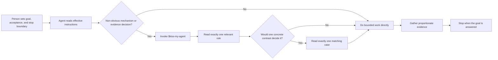

# KISS My Agent

**Keep It Simple, Scientist.**<br>
**Less ceremony. More science.**

[](LICENSE)


[English](README.md) · [简体中文](README.zh-CN.md) · [Installation](docs/INSTALLATION.md) · [Configuration](docs/CONFIGURATION.md) · [Extending](docs/EXTENDING.md) · [FAQ](docs/FAQ.md) · [Contributing](CONTRIBUTING.md)

KISS My Agent is a compact, reusable instruction layer for research-oriented coding agents. It keeps the person in charge of the research question while helping agents choose direct implementation, proportionate evidence, and only the mechanisms that have a current consumer.

## Why

Agent-assisted engineering can drift into workflow for workflow's sake: extra gates, wrappers, manifests, compatibility layers, or agent coordination systems that do not improve the requested result. KISS My Agent provides durable boundaries and one precisely routed skill for the decisions where “keep it local” versus “build a mechanism” is genuinely unclear.

The goal is not fewer safeguards at any cost. It is the smallest sufficient design that preserves real product contracts, safety boundaries, failure visibility, and scientific validity.

## What You Get

- A general [`AGENTS.md`](AGENTS.md) with permanent human/agent boundaries.
- Three optional, collision-resistant Codex roles in [`.codex/agents/`](.codex/agents/): `kiss_explorer`, `kiss_coder`, and `kiss_reviewer`.
- The [`$kiss-my-agent`](.agents/skills/kiss-my-agent/SKILL.md) skill, with two decision rules and four narrow cases loaded only when relevant.
- A [configuration guide](docs/CONFIGURATION.md) and an inert, annotated [`config.example.toml`](examples/config.example.toml) for host-specific runtime choices.
- A layered-instruction fixture and twelve manual scenarios under [`tests/`](tests/).
- A dependency-light static validator under [`scripts/`](scripts/).
- Installation, extension, security, and community documentation without an installer or workflow platform.

## 5-minute Quick Start

From an existing checkout, run the static validator without installing anything into user or project configuration:

```bash
cd /absolute/path/to/kiss-my-agent
./scripts/validate.sh
```

For live discovery, start a new authenticated session only if normal Host-managed state updates are acceptable:

```bash
codex
```

In the new authenticated session, run `/skills` and confirm `kiss-my-agent` is listed. Invoke the Skill explicitly with `$kiss-my-agent` only for a matching non-obvious engineering or evidence decision. The optional KISS Agent files are templates and become available only after deliberate registration in the intended config layer.

The validator is repository-local and does not write user configuration. A real Codex or Desktop session may record normal Host state such as project trust, history, or marketplace timestamps under its configured home even when no KISS component is installed. Use a disposable OS account or Host profile if absolutely no user-state write is acceptable. See [Installation](docs/INSTALLATION.md) only when you decide to adopt one or more components into another project or personal scope.

## Adopt Only What You Need

1. **Validate without installing.** Run the repository-local validator. Optionally start a new authenticated Host session and confirm `kiss-my-agent` with `/skills`, accepting that the Host may record normal local metadata.
2. **Skill only.** Copy [`.agents/skills/kiss-my-agent/`](.agents/skills/kiss-my-agent/) into exactly one project or user scope.
3. **AGENTS guidance.** Manually merge only the relevant boundaries into the actual effective instruction source; never overwrite an existing AGENTS or override.
4. **Optional KISS roles.** Add and register the prefixed role files only when their names are absent. Existing generic roles remain untouched.

Existing config, AGENTS, Agents, and Skills are preserved by default. The collision matrix and exact commands are documented in [Installation](docs/INSTALLATION.md).

## Customize the Runtime

The supplied values are editable examples, not KISS My Agent requirements. There is no `master.toml`: the primary or master thread uses the effective model, reasoning, context, permission, Profile, and CLI settings of the current session.

| Execution role | Supplied model | Supplied reasoning | Supplied sandbox | Where to change it |
| --- | --- | --- | --- | --- |
| Master / primary | Host selection | Host selection | Host selection | User/project config, Profile, UI, or CLI |
| KISS Explorer | `gpt-5.6-sol` | `medium` | `read-only` | `.codex/agents/kiss_explorer.toml` |
| KISS Coder | `gpt-5.6-sol` | `high` | `workspace-write` | `.codex/agents/kiss_coder.toml` |
| KISS Reviewer | `gpt-5.6-sol` | `xhigh` | `read-only` | `.codex/agents/kiss_reviewer.toml` |

Choose models and efforts supported by your host. Permission changes alter real authority. `agents.max_concurrent_threads_per_session` is a capacity cap, not a request to use every slot. Context-window and auto-compaction overrides are model/provider-specific; leaving them unset uses model defaults.

See [Configuration](docs/CONFIGURATION.md) for models, reasoning, concurrency, context, compaction, permissions, instruction discovery, Profiles, and one-off overrides. The [`config.example.toml`](examples/config.example.toml) is not loaded from its tracked location and is never installed automatically.

## How It Works



The skill is deliberately not a catch-all workflow. It routes one ambiguity to one rule and, only when useful, one case.

## Core Principles

- **People own the question.** Agents act inside the stated goal, architecture, acceptance, non-goals, and stop boundary.
- **No change is a result.** Evidence can show that the current behavior is already correct or that the issue lies outside scope.
- **Results beat ceremony.** Diffs, agent count, tests, commits, and gates are tools, not completion criteria.
- **Local needs stay local.** A single-caller fix does not need a framework without another current consumer.
- **Mechanisms pay rent.** Persistent or shared machinery must serve a real consumer, observed problem, or concrete high-consequence risk.
- **Failures stay visible.** Internal bugs and invariant violations propagate; optional degradation is narrow and explicit.
- **Evidence keeps its level.** Source inspection, tests, builds, runs, and experiments support different claims.
- **Stop when answered.** Do not extend the system after proportionate evidence resolves the user's question.

## Three Small Examples

### 1. Local fix, not a parsing platform

One private parser mishandles an empty value for its only caller. Fix and test the parser locally. Do not add a schema registry and migration service for hypothetical consumers.

### 2. Explicit degradation, not hidden failure

An optional external lookup is unavailable. Remove only its optional influence and expose the degraded reason. An unexpected internal computation error must still fail visibly.

### 3. Replay or recollect

An evaluator interpretation changes while captured runtime signals remain complete. Replay can isolate evaluator behavior. Recollect when timing, missing signals, runtime interaction, or causal attribution matters.

## Project Structure

```text
.
├── AGENTS.md
├── .agents/skills/kiss-my-agent/
│   ├── SKILL.md
│   └── references/{rules,cases}/
├── .codex/agents/{kiss_explorer,kiss_coder,kiss_reviewer}.toml
├── assets/kiss-my-agent-hero.png
├── docs/{INSTALLATION,CONFIGURATION,EXTENDING,FAQ}.md
├── examples/config.example.toml
├── scripts/validate.sh
├── tests/{fixtures,scenarios.md}
├── CONTRIBUTING.md
├── CODE_OF_CONDUCT.md
├── SECURITY.md
└── LICENSE
```

## Validation Boundaries

Run:

```bash
./scripts/validate.sh
```

| Check | Current coverage |
| --- | --- |
| TOML, Skill, links, hero, and instruction fixture | Statically validated |
| Codex CLI `0.152.0` | Skill metadata, explicit linked-Rule routing, and all three registered KISS Agent types validated |
| ChatGPT Desktop `26.825.51511` | Bundled engine validated; a GUI new-project session was not independently created because this clone is not a saved Desktop project |
| Desktop bundled Codex `0.151.0-alpha.7.2` | Skill metadata, explicit linked-Rule routing, and registered `kiss_explorer` spawn validated |
| Existing configuration coexistence | First install, duplicate blocking, and pre-existing config/AGENTS/generic-role preservation validated in a temporary fixture |
| Guaranteed Agent compliance | Not claimed |
| Other agent hosts | Not verified |

No sandbox package, copied `CODEX_HOME`, Docker image, or extra test project is required. Testers can validate the clone directly, then optionally use a new authenticated Host session for `/skills` and custom Agent discovery. The live Host check is not a zero-write test of Host-owned state.

The static validator checks repository structure, role TOML, skill frontmatter and routing, bilingual README links and sections, relative links, project hygiene, shell syntax, the fixture instruction chain, and the hero asset. It does **not** prove model behavior, research validity, integration with every host, network installation, permissions, authentication, release readiness, or compatibility with future Codex versions.

This project is Codex-first. Other agent hosts have not been verified. There is no automatic installer, CI pipeline, release channel, or generated evaluation score.

## Extending and Contributing

Read [Extending](docs/EXTENDING.md) before adding a rule or case. New material must resolve a present recurring ambiguity without turning the skill into a general handbook. Contributions follow [CONTRIBUTING.md](CONTRIBUTING.md) and the [Code of Conduct](CODE_OF_CONDUCT.md). Report vulnerabilities through [SECURITY.md](SECURITY.md).

## Limitations

- Early-stage source distribution with no compatibility guarantee or release automation.
- Codex-first; other hosts and discovery conventions are unverified.
- Instructions guide behavior but cannot grant filesystem, network, account, or authentication authority.
- Model availability varies. Role TOML values are editable examples; the validator checks structure rather than enforcing one model, effort, or role permission.
- The manual scenarios are discussion fixtures, not behavioral qualification or an evaluation gate.
- Project-specific safety, compliance, and domain rules remain the adopter's responsibility.

## FAQ

See [docs/FAQ.md](docs/FAQ.md) for Skill routing, configuration, safe coexistence, tested Hosts, and validation boundaries.

## License

[MIT](LICENSE)
