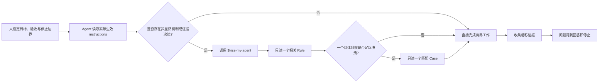

# KISS My Agent

**Keep It Simple, Scientist.**<br>
**Less ceremony. More science.**

[](LICENSE)


[English](README.md) · [简体中文](README.zh-CN.md) · [安装](docs/INSTALLATION.md) · [扩展](docs/EXTENDING.md) · [常见问题](docs/FAQ.md) · [贡献](CONTRIBUTING.md)

KISS My Agent 是面向科研型编码 Agent 的紧凑、可复用指令层。它让人持续掌握研究问题，同时帮助 Agent 选择直接实现、相称证据，以及只为当前真实 consumer 服务的机制。

## 为什么需要它

Agent 辅助工程容易滑向“为了流程而流程”：增加 gate、wrapper、manifest、兼容层或 Agent 协作系统，却没有改善用户要求的结果。KISS My Agent 提供长期硬边界，以及一个精确路由的 Skill，专门处理“保持局部”还是“建设机制”确实不明显的决策。

目标并非不计代价地减少保护，而是采用能保持真实产品契约、安全边界、失败可见性和科学有效性的最小充分设计。

## 你将获得什么

- 通用 [`AGENTS.md`](AGENTS.md)，定义永久的人与 Agent 边界。
- [`.codex/agents/`](.codex/agents/) 中三个聚焦的 Codex 角色：explorer、coder、review。
- [`$kiss-my-agent`](.agents/skills/kiss-my-agent/SKILL.md) Skill，包含两个决策 Rules 和四个窄 Cases，仅在相关时加载。
- [`tests/`](tests/) 下的分层指令 fixture 与十二个人工场景。
- [`scripts/`](scripts/) 下的静态 validator 和隔离本地 sandbox staging 脚本。
- 安装、扩展、安全与社区文档；不包含 installer 或工作流平台。

## 5 分钟快速开始

从本仓库已有 checkout 出发，将 Skill 安装到一个目标项目，不触碰用户级配置：

```bash
export KISS_REPO_ROOT=/absolute/path/to/kiss-my-agent
export TARGET_PROJECT=/absolute/path/to/your-project

mkdir -p "$TARGET_PROJECT/.agents/skills"
test ! -e "$TARGET_PROJECT/.agents/skills/kiss-my-agent"
cp -R "$KISS_REPO_ROOT/.agents/skills/kiss-my-agent" "$TARGET_PROJECT/.agents/skills/"
```

在目标项目启动新的 Codex 会话，运行 `/skills`，确认列出 `kiss-my-agent`。只有遇到匹配的非显然工程或证据决策时，才用 `$kiss-my-agent` 显式调用。

如果目标已存在，停止并进行 diff；不要覆盖。项目规则、自定义 Agent、用户级安装和安全更新见[安装说明](docs/INSTALLATION.md)。

## 三种采用方式

1. **只采用 Rules。** 将 [`AGENTS.md`](AGENTS.md) 中相关边界人工合并到目标项目现有 instructions；绝不覆盖已有 instruction 文件。
2. **只采用 Skill。** 将 [`.agents/skills/kiss-my-agent/`](.agents/skills/kiss-my-agent/) 复制到项目级或用户级 Skill 目录，并在新会话中用 `/skills` 确认。
3. **完整 Codex 配置。** 组合经过审查的 `AGENTS.md` 合并、仓库级 Skill，以及 [`.codex/agents/`](.codex/agents/) 中的项目级角色。它仍不会复制 `config.toml`，也不会改变认证或权限。

精确命令和优先级见[安装说明](docs/INSTALLATION.md)。

## 工作方式



这个 Skill 刻意不是 catch-all 工作流。它把一个歧义路由到一个 Rule，并且只在有用时再读一个 Case。

## 核心原则

- **人拥有问题。** Agent 在既定目标、架构、验收、非目标和停止边界内行动。
- **无需修改也是结果。** 证据可以说明当前行为已正确，或问题位于范围外。
- **结果优先于仪式。** diff、Agent 数量、测试、commit 与 gate 都是工具，不是完成标准。
- **局部需求保持局部。** 单 caller 修复不因假想 consumer 而建设框架。
- **机制必须付租金。** 持久或共享机制必须服务真实 consumer、已观察问题或具体高后果风险。
- **失败保持可见。** 内部 bug 与 invariant 违反传播；可选降级必须狭窄且显式。
- **证据不越级。** 源码检查、测试、构建、运行和实验支持不同声明。
- **回答后停止。** 相称证据已经回答用户问题后，不继续扩张系统。

## 三个小例子

### 1. 局部修复，而不是解析平台

一个私有 parser 为唯一 caller 错误处理空值。局部修复并测试它，不为假想 consumer 新增 schema registry 与 migration service。

### 2. 显式降级，而不是隐藏失败

一个可选外部查询不可用。只移除它的可选影响并公开 degraded 原因；意外的内部计算错误仍必须明确失败。

### 3. Replay 还是重新采集

当已采集 runtime 信号完整，而 evaluator 解释发生变化时，可用 replay 隔离 evaluator 行为。若时序、缺失信号、runtime 交互或因果归因重要，则重新采集。

## 项目结构

```text
.
├── AGENTS.md
├── .agents/skills/kiss-my-agent/
│   ├── SKILL.md
│   └── references/{rules,cases}/
├── .codex/agents/
├── assets/kiss-my-agent-hero.png
├── docs/{INSTALLATION,EXTENDING,FAQ}.md
├── scripts/{validate,stage-sandbox}.sh
├── tests/{fixtures,scenarios.md}
├── CONTRIBUTING.md
├── CODE_OF_CONDUCT.md
├── SECURITY.md
└── LICENSE
```

## 验证边界

运行：

```bash
./scripts/validate.sh
./scripts/stage-sandbox.sh
./scripts/validate.sh
```

`stage-sandbox.sh` **只删除并重建**本仓库的 `.sandbox/`，创建隔离的内层项目，复制项目级 Skill 与 Agent，并打印启动命令。它不会启动 Codex，也不会写真实用户配置。

静态 validator 检查仓库结构、角色 TOML、Skill frontmatter 与路由、双语 README 互链和章节、相对链接、开源卫生、shell 语法、fixture instruction chain 与 hero 资产。它**不能**证明模型行为、研究有效性、所有宿主集成、网络安装、权限、认证、发布就绪，或与未来 Codex 版本兼容。

本项目以 Codex 为首要宿主；其他 Agent host 尚未验证。项目没有自动 installer、CI pipeline、release channel 或生成的 eval score。

## 扩展与贡献

新增 Rule 或 Case 前先读[扩展说明](docs/EXTENDING.md)。新增材料必须解决当前反复出现的歧义，不能把 Skill 扩成通用手册。贡献遵循 [CONTRIBUTING.md](CONTRIBUTING.md) 与[行为准则](CODE_OF_CONDUCT.md)，漏洞报告遵循 [SECURITY.md](SECURITY.md)。

## 限制

- 早期源码分发，不提供兼容性保证或 release automation。
- Codex-first；其他宿主与发现约定尚未验证。
- Instructions 只能指导行为，不能授予文件系统、网络、账户或认证权限。
- 模型可用性因环境而异；角色 TOML 可能需要经审查地修改模型，并同步 validator 预期。
- 人工场景是讨论 fixture，不是行为资格证明或 eval gate。
- 项目特定安全、合规与领域规则仍由采用者负责。

## 常见问题

何时调用 Skill、如何安全更新、为何没有 installer、sandbox 能证明什么，见 [docs/FAQ.md](docs/FAQ.md)。

## 许可证

[MIT](LICENSE)
