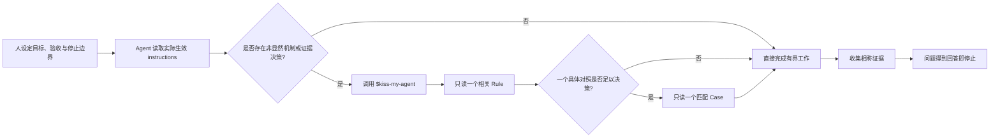

# KISS My Agent

**Keep It Simple, Scientist.**<br>
**Less ceremony. More science.**

[](LICENSE)


[English](README.md) · [简体中文](README.zh-CN.md) · [安装](docs/INSTALLATION.md) · [配置](docs/CONFIGURATION.md) · [扩展](docs/EXTENDING.md) · [常见问题](docs/FAQ.md) · [贡献](CONTRIBUTING.md)

KISS My Agent 是面向科研型编码 Agent 的紧凑、可复用指令层。它让人持续掌握研究问题，同时帮助 Agent 选择直接实现、相称证据，以及只为当前真实 consumer 服务的机制。

## 为什么需要它

Agent 辅助工程容易滑向“为了流程而流程”：增加 gate、wrapper、manifest、兼容层或 Agent 协作系统，却没有改善用户要求的结果。KISS My Agent 提供长期硬边界，以及一个精确路由的 Skill，专门处理“保持局部”还是“建设机制”确实不明显的决策。

目标并非不计代价地减少保护，而是采用能保持真实产品契约、安全边界、失败可见性和科学有效性的最小充分设计。

## 你将获得什么

- 通用 [`AGENTS.md`](AGENTS.md)，定义永久的人与 Agent 边界。
- [`.codex/agents/`](.codex/agents/) 中三个可选且避免通用名称冲突的 Codex 角色：`kiss_explorer`、`kiss_coder`、`kiss_reviewer`。
- [`$kiss-my-agent`](.agents/skills/kiss-my-agent/SKILL.md) Skill，包含两个决策 Rules 和四个窄 Cases，仅在相关时加载。
- 一份[配置指南](docs/CONFIGURATION.md)与不自动生效、带注释的 [`config.example.toml`](examples/config.example.toml)，用于适配不同 Host。
- [`tests/`](tests/) 下的分层指令 fixture 与十二个人工场景。
- [`scripts/`](scripts/) 下轻量、低依赖的静态 validator。
- 安装、扩展、安全与社区文档；不包含 installer 或工作流平台。

## 5 分钟快速开始

从已有 checkout 运行静态验证，不向用户级或其他项目配置安装任何内容：

```bash
cd /absolute/path/to/kiss-my-agent
./scripts/validate.sh
```

若可以接受 Host 写入其正常管理状态，再启动新的已认证会话检查真实发现：

```bash
codex
```

在新的已认证会话中运行 `/skills`，确认列出 `kiss-my-agent`。只有遇到匹配的非显然工程或证据决策时，才用 `$kiss-my-agent` 显式调用。可选 KISS Agent 文件是模板，只有在目标 config layer 中被明确注册后才会成为可用角色。

静态 validator 只读取仓库，不写用户配置。真实 Codex 或 Desktop 会话即使没有安装 KISS 组件，也可能在其配置目录记录项目 trust、历史或 marketplace 时间戳等正常 Host 状态。若要求用户状态绝对零写入，应使用一次性操作系统账户或 Host profile。只有决定将组件采用到其他项目或个人 scope 时，才需要阅读[安装说明](docs/INSTALLATION.md)。

## 只采用需要的组件

1. **无需安装直接验证。** 先运行仓库内静态 validator；可选地启动新的已认证 Host 会话，用 `/skills` 确认 `kiss-my-agent`，同时接受 Host 可能记录正常本地元数据。
2. **只采用 Skill。** 将 [`.agents/skills/kiss-my-agent/`](.agents/skills/kiss-my-agent/) 安装到且只安装到一个项目级或用户级 scope。
3. **采用 AGENTS 原则。** 只把适用边界人工合并到实际生效的 instruction source；绝不覆盖已有 AGENTS 或 override。
4. **可选 KISS 角色。** 只有目标中不存在对应前缀名称时才复制并注册；已有通用角色保持不变。

已有 config、AGENTS、Agent 与 Skill 默认全部保留。冲突矩阵、精确命令和优先级见[安装说明](docs/INSTALLATION.md)。

## 自定义运行配置

仓库提供的是可修改示例，不是 KISS My Agent 硬性要求。项目不创建 `master.toml`：Master/主线程使用当前会话实际生效的模型、reasoning、上下文、权限、Profile 与 CLI 设置。

| 执行角色 | 示例模型 | 示例 reasoning | 示例 sandbox | 修改位置 |
| --- | --- | --- | --- | --- |
| Master / 主线程 | Host 选择 | Host 选择 | Host 选择 | 用户/项目配置、Profile、UI 或 CLI |
| KISS Explorer | `gpt-5.6-sol` | `medium` | `read-only` | `.codex/agents/kiss_explorer.toml` |
| KISS Coder | `gpt-5.6-sol` | `high` | `workspace-write` | `.codex/agents/kiss_coder.toml` |
| KISS Reviewer | `gpt-5.6-sol` | `xhigh` | `read-only` | `.codex/agents/kiss_reviewer.toml` |

模型和 effort 必须受当前 Host 支持；修改权限会改变真实授权范围。`agents.max_concurrent_threads_per_session` 是容量上限，不代表应该用满。Context window 与自动压缩阈值依赖具体模型和 Provider；不设置时使用模型默认值。

[配置指南](docs/CONFIGURATION.md)详细说明模型、reasoning、并发、上下文、自动压缩、权限、instruction 发现、Profile 和一次性 override。[`config.example.toml`](examples/config.example.toml) 在仓库中的位置不会被 Codex 加载，也不会自动安装。

## 工作方式



这个 Skill 刻意不是 catch-all 工作流。它把一个歧义路由到一个 Rule，并且只在有用时再读一个 Case。

## 核心原则

- **人拥有问题。** Agent 在既定目标、架构、验收、非目标和停止边界内行动。
- **无需修改也是结果。** 证据可以说明当前行为已正确，或问题位于范围外。
- **结果优先于仪式。** diff、Agent 数量、测试、commit 与 gate 都是工具，不是完成标准。
- **局部需求保持局部。** 单 caller 修复不因假想 consumer 而建设框架。
- **机制必须付租金。** 持久或共享机制必须服务真实 consumer、已观察问题或具体高后果风险。
- **失败保持可见。** 内部 bug 与 invariant 违反传播；可选降级必须狭窄且显式。
- **证据不越级。** 源码检查、测试、构建、运行和实验支持不同声明。
- **回答后停止。** 相称证据已经回答用户问题后，不继续扩张系统。

## 三个小例子

### 1. 局部修复，而不是解析平台

一个私有 parser 为唯一 caller 错误处理空值。局部修复并测试它，不为假想 consumer 新增 schema registry 与 migration service。

### 2. 显式降级，而不是隐藏失败

一个可选外部查询不可用。只移除它的可选影响并公开 degraded 原因；意外的内部计算错误仍必须明确失败。

### 3. Replay 还是重新采集

当已采集 runtime 信号完整，而 evaluator 解释发生变化时，可用 replay 隔离 evaluator 行为。若时序、缺失信号、runtime 交互或因果归因重要，则重新采集。

## 项目结构

```text
.
├── AGENTS.md
├── .agents/skills/kiss-my-agent/
│   ├── SKILL.md
│   └── references/{rules,cases}/
├── .codex/agents/{kiss_explorer,kiss_coder,kiss_reviewer}.toml
├── assets/kiss-my-agent-hero.png
├── docs/{INSTALLATION,CONFIGURATION,EXTENDING,FAQ}.md
├── examples/config.example.toml
├── scripts/validate.sh
├── tests/{fixtures,scenarios.md}
├── CONTRIBUTING.md
├── CODE_OF_CONDUCT.md
├── SECURITY.md
└── LICENSE
```

## 验证边界

运行：

```bash
./scripts/validate.sh
```

| 检查 | 当前覆盖 |
| --- | --- |
| TOML、Skill、链接、hero 与 instruction fixture | 已静态验证 |
| Codex CLI `0.152.0` | 已验证 Skill 元数据、显式 linked-Rule 路由和三个已注册 KISS Agent 类型 |
| ChatGPT Desktop `26.825.51511` | 已验证内置引擎；因该 clone 尚未保存为 Desktop 项目，未独立创建 GUI 新项目会话 |
| Desktop 内置 Codex `0.151.0-alpha.7.2` | 已验证 Skill 元数据、显式 linked-Rule 路由与已注册 `kiss_explorer` spawn |
| 现有配置共存 | 已在临时 fixture 验证首次安装、重复阻止，以及已有 config/AGENTS/通用角色保持不变 |
| Agent 必然遵守规则 | 不作保证 |
| 其他 Agent Host | 尚未验证 |

不需要安装 sandbox package、复制 `CODEX_HOME`、运行 Docker 或创建额外测试项目。测试者可以直接验证 clone，再按需在新的已认证 Host 会话中检查 `/skills` 和自定义 Agent 发现；后者不是 Host 自有状态的零写入测试。

静态 validator 检查仓库结构、角色 TOML、Skill frontmatter 与路由、双语 README 互链和章节、相对链接、开源卫生、shell 语法、fixture instruction chain 与 hero 资产。它**不能**证明模型行为、研究有效性、所有宿主集成、网络安装、权限、认证、发布就绪，或与未来 Codex 版本兼容。

本项目以 Codex 为首要宿主；其他 Agent host 尚未验证。项目没有自动 installer、CI pipeline、release channel 或生成的 eval score。

## 扩展与贡献

新增 Rule 或 Case 前先读[扩展说明](docs/EXTENDING.md)。新增材料必须解决当前反复出现的歧义，不能把 Skill 扩成通用手册。贡献遵循 [CONTRIBUTING.md](CONTRIBUTING.md) 与[行为准则](CODE_OF_CONDUCT.md)，漏洞报告遵循 [SECURITY.md](SECURITY.md)。

## 限制

- 早期源码分发，不提供兼容性保证或 release automation。
- Codex-first；其他宿主与发现约定尚未验证。
- Instructions 只能指导行为，不能授予文件系统、网络、账户或认证权限。
- 模型可用性因环境而异；角色 TOML 是可修改示例，validator 只检查结构，不强制单一模型、effort 或角色权限。
- 人工场景是讨论 fixture，不是行为资格证明或 eval gate。
- 项目特定安全、合规与领域规则仍由采用者负责。

## 常见问题

Skill 路由、配置、安全共存、已测试 Host 与验证边界见 [docs/FAQ.md](docs/FAQ.md)。

## 许可证

[MIT](LICENSE)
