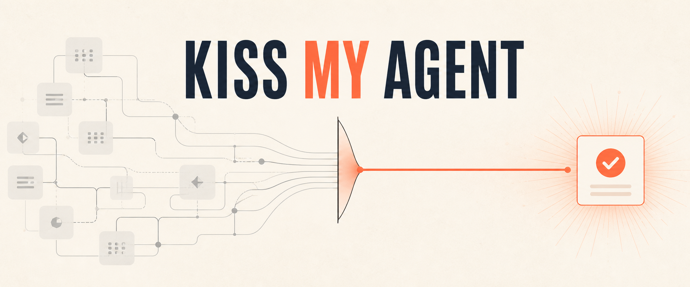

<div class="readme-intro" align="center" markdown="1">

# KISS My Agent

**Keep It Simple, Scientist. Less ceremony. More science.**

一个帮助科研工程类 Codex Agent 专注解决你所提出任务的 Plugin，避免 Agent 把不确定性变成多余系统、隐藏 fallback 或流程表演。

[English](https://aoiota.github.io/Kiss-My-Agent/) | [简体中文](https://aoiota.github.io/Kiss-My-Agent/zh-CN/)

[](LICENSE)
[](https://github.com/AoiOTA/Kiss-My-Agent/actions/workflows/validate.yml)


</div>

<a id="why-this-exists"></a>
## 为什么需要它

我们经常要求编码 Agent 做得全面、安全、可复用、面向未来，而 Agent 同时只能从不完整的上下文开始工作。这些目标本身都合理，但如果真正的验收边界不清楚，Agent 就可能把任务做得更大，而不是把结果做得更好。

你可能见过这些症状：

- 一个 parser bug 最后变成了 framework、registry、配置层和迁移计划；
- 内部错误被捕获后，以空结果或过期数据伪装成“成功”；
- 没有当前 consumer，却增加了猜想性的检查、gate、状态机或遥测；
- 一个线程本可清楚完成的工作，却创建了多个 Agent 和一套交接产物；
- 只是测试通过，Agent 就声称产品目标或科研目标已经得到证明；
- 已满足用户结果后，Agent 仍继续打磨、扩展。

KISS My Agent 为这些决策给 Codex 一组小而持久的边界：人掌握目标；Agent 优先选择最小充分改动、让失败可见、使用相称证据，并在真实停止点停下。

<a id="overengineering-and-overdefense"></a>
## 什么是过度设计和过度防御

**过度设计**是指添加当前任务及其真实 consumer 并不需要的抽象、基础设施、配置、兼容层、工作流或持久状态。

**过度防御**是指面对不确定性时，用一些行为掩盖真实情况，例如宽泛地 catch-and-continue、回退到过期数据、叠加重复安全层、发明审批 gate，或在真实安全与权限边界之外拒绝行动。

必要的安全措施不是过度防御。认证、最小权限、真实边界上的输入验证、安全清理，以及对已知可选服务故障的显式处理，都可能不可或缺。真正的问题是：防御机制隐藏了内部 bug、改变了用户的验收标准，或者没有保护具体风险却增加了成本。

没有哪一种任务或关键词必然触发这些问题；KISS My Agent 也不是绕过 Codex 安全限制的工具。它通过明确 owner、失败语义、证据与停止规则来降低这种倾向。

<a id="when-it-happens"></a>
## Agent 在什么时候最容易偏离

以下情况风险更高：prompt 要求“全面”“稳健”“生产就绪”或“面向未来”，却没有具体的验收标准；失败路径或可选依赖含义模糊；runtime 行为与测试或 evaluator 不一致；科研声明强于实验依据；或者多 Agent 协调本身开始变成产品。

这不是 Codex 独有的问题，也不会在每次会话中发生。语言模型编码 Agent 会根据现有 instructions 和上下文推断意图。当存在多个看似合理的方案时，更复杂的方案可能看起来更安全、更完整，即使它对当前目标反而更差。

<a id="how-kiss-helps"></a>
## KISS My Agent 如何减轻问题

| 偏离 | KISS 边界 | 预期结果 |
| --- | --- | --- |
| Agent 扩大了定义不清的目标 | 人拥有目标、架构、验收标准、非目标和停止边界 | 实质性扩 scope 时回到用户决策 |
| 局部需求变成共享系统 | 单 consumer 需求留在 owning module，除非真实边界或第二个 consumer 证明值得抽取 | 改动更小、更容易审查 |
| 防御代码隐藏缺陷 | 传播内部 bug；只为明确、预期的可选失败降级，并显示原因 | 失败仍可诊断 |
| 检查结果被夸大成更强声明 | 区分源码检查、测试、构建、Smoke、Pilot 与 Final 证据 | 只汇报实际证明的内容 |
| 多 Agent 变成固定仪式 | 简单一次性任务使用普通单对话；只有已配置的复杂项目才动态委派 | 默认扁平 direct fan-out；合格的大型子系统最多一个临时 lead |
| 为制造信心而继续工作 | 允许有证据支持的“无需修改”，相称证据回答目标后停止 | 减少无谓 churn 和流程表演 |

这些是指导约束，不是形式化 verifier，也不保证行为。它们改善 Codex 作决策时的上下文，但无法保证所有模型、prompt 或未来 Host 版本表现完全一致。

<a id="is-it-for-you"></a>
## 它适合你吗

如果你符合以下情况，KISS My Agent 会比较适合：

- 用 Codex 开发科研软件、实验、基础设施，或进行调试和实质性工程工作；
- 希望 Agent 区分局部修复与真正有理由建立的共享机制；
- 在意失败保持可见，并希望结论强度与证据匹配；
- 希望按需使用多 Agent，而不是采用固定流水线或强制团队规模；
- 偏好可由贡献者检查和修改的项目内边界。

如果你想要的是以下能力，它可能不适合：

- 通用自主编排器、审批平台、遥测服务或评测系统；
- 绕过 Codex 权限、管理员策略、项目 trust 或安全控制；
- 确定性地保证模型永远不会过度设计；
- 已验证支持 Codex 以外的 Host；
- 给边界已经很清楚的一次性简单工作增加更多流程。

<a id="quick-start"></a>
## 三分钟开始使用

**普通用户只需要 Codex、可用的 `git` executable 与 GitHub 网络访问。Setup 和 Agent 配置不需要 Python、Node.js、Docker、包管理器或独立的 KISS executable。**

先选择与任务匹配的模式：

- **简单一次性任务：** 如果需要 decision Skill，可以安装 Plugin，但跳过 project setup，使用用户选择 model/effort 的普通单对话。
- **复杂科研工程项目：** 按下面步骤安装持久 executive workflow，由 Master 调度并委派日常执行工作。

1. 从 Git-backed marketplace 安装 Plugin：

```bash
codex plugin marketplace add AoiOTA/Kiss-My-Agent
codex plugin add kiss-my-agent@kiss-my-agent
```

2. 只有选择复杂项目持久模式时，才在准备配置的项目中启动新的已认证 Codex 会话，然后运行：

```text
$kiss-my-agent-setup set up this project
```

3. 当 Codex Host 提示时信任该项目。再启动一个新会话，让项目 instructions 和角色被发现，然后运行：

```text
$kiss-my-agent-setup check this project
```

到这里，项目持久模式配置完成。你不需要每次提任务前调用 Skill，像平时一样直接让 Codex 工作即可：

```text
Find the cause of this failing parser test, make the smallest correct fix, and run the affected tests.
```

Setup 管理四个 config paths：成对的 Master model/effort defaults 与两个公开 multi-agent 开关。只有首次 setup 或精确 v0.1 migration 且两个 Master keys 都缺失时才添加这一对；若任一 Master key 已存在，另一个保持缺失。两个 feature defaults 各自在缺失时添加。Setup 还提供 `kiss_explorer`、`kiss_coder`、`kiss_reviewer` 三个 seed，并保留已有值与用户改动。若已配置 workflow 的 delegation 被禁用、不可用或没有合适角色，Master 会报告 staffing issue，让用户选择修复 staffing 或明确把本任务切换为普通单对话；不会静默接手。精确边界、Host 支持条件与新会话要求见[安装](docs/INSTALLATION.zh-CN.md)。

<a id="how-to-use"></a>
## 到底该调用什么

| 需要 | 做法 |
| --- | --- |
| 简单一次性实现、调试、测试、审查或 Git 工作 | 使用普通单对话，不需要 project setup。 |
| 复杂项目的持久 executive workflow | 运行 project setup 后正常提要求；Master 按项目 `AGENTS.md` 调度并委派日常执行工作。 |
| 对共享机制、局部修复还是新系统、隐藏失败、实验有效性、证据强度、runtime/evaluator 不一致或扩 scope 存在一个重要且不显然的决策 | 为这个决策显式调用 `$kiss-my-agent`，然后回到原任务。它不是通用工作流。 |
| 安装、检查、移除 KISS 文件，或配置现有角色 | 使用 `$kiss-my-agent-setup`，并明确项目或全局 scope。 |

三个内置角色是可编辑的 seeds，不是强制工作流或封闭 catalog：

- `kiss_explorer` 以 `gpt-5.6-sol` / `high` 负责有边界的只读调查。
- `kiss_coder` 以 `gpt-5.6-sol` / `high` 负责有边界的实现及其检查。
- `kiss_reviewer` 以 `gpt-5.6-sol` / `xhigh` 负责独立只读审查。

Bundled Master default 是 `gpt-5.6-sol` / `max`。Host 与账号必须支持这些 model/effort；setup 会保留目标中已有的选择。Master 动态选择当前可用角色，同一角色可以启动多个实例。组织默认扁平：Master 直接 fan-out 到当前角色，同时每个共享文件或资源保持一个 writer/operator。

只有大型独立子系统需要大量并行、且直接汇总会污染 Master context 时，才可临时让一个现有 Agent 担任有界的 department lead。该 lead 可在自身 scope 内委派并向 Master 汇总，但其 workers 不再委派。Assignment 随任务结束而消失：最多一层中间管理，不形成永久部门、新角色、固定人数或深层层级。

可以把它类比为一家小公司：用户或 Owner 确定目标，Master 像 CEO，负责战略、架构与验收决策、调度、冲突解决、证据判断和最终汇总；explorer 提供情报，coder 负责工程实现，reviewer 做独立审计。这只是帮助理解 ownership，不是固定 pipeline、强制团队或游戏机制。

<a id="before-and-after"></a>
## 两个具体对照

### 一个 parser 缺陷

**之前：** Parser 在一个合法输入上失败。修复方案却为“未来的 parsers”增加通用验证 framework、adapter registry、新配置 schema、兼容模式和大范围 test harness。

**使用 KISS：** 追踪真正生效的 parser 及其 consumer，在 owning module 修复缺陷，添加一个修复前失败的最小回归用例，运行受影响的测试闭包，然后停止。只有第二个当前 consumer 或真实接口边界需要时，才抽取共享行为。

### 一个可选服务不可用

**之前：** 宽泛的异常处理返回空成功或过期 enrichment，让内部计算 bug 看起来像预期的服务故障。

**使用 KISS：** 只在 owner 边界捕获已知的可用性失败，保持主行为正确，公开降级原因，让内部缺陷携带原始原因失败。这样保留真正的安全性，也不隐藏错误。

<a id="configure-agents"></a>
## 配置 Master 与 Roles

Bundled defaults 为：`kiss_explorer` 与 `kiss_coder` 使用 `gpt-5.6-sol` / `high`，`kiss_reviewer` 使用 `gpt-5.6-sol` / `xhigh`，Master 使用 `gpt-5.6-sol` / `max`。这些值要求 Host/账号支持，也不是锁定。

Master settings 属于所选 scope 的 `config.toml`，不属于 role。请直接编辑其中的 `model` 与 `model_reasoning_effort`。若不支持的持久配置导致 Master 无法启动，先用单次 CLI override 启动，再修复持久 config 并另开新会话：

```bash
codex --config 'model="HOST_SUPPORTED_MODEL_ID"' --config 'model_reasoning_effort="HOST_SUPPORTED_EFFORT"'
```

对话向导只配置已有 role TOML：

```text
$kiss-my-agent-setup configure agents for this project
$kiss-my-agent-setup configure global agents
```

向导只能修改现有角色的 `model`、`model_reasoning_effort` 和 `sandbox_mode`，不能修改 Master。它会预览 diff、保留所有无关字段，并对 `danger-full-access` 单独二次确认。它不维护模型目录，也不创建、删除或重命名角色。

如需手工配置，请编辑 `<project>/.codex/agents/` 或 `$CODEX_HOME/agents/` 下对应的 standalone role 文件，详见[配置](docs/CONFIGURATION.zh-CN.md)。Role 文件里显式的 `model` 或 `model_reasoning_effort` 是 role override；任一字段省略时，依次按显式 spawn 设置、`[agents]` 默认值、父会话已解析设置决定。父会话实时的 sandbox/approval 状态与管理员要求仍可限制权限。修改角色后请启动新会话。

<a id="updates"></a>
## 一键手动刷新

更新已安装的 Plugin、确认最终解析到的版本，然后启动新的 Codex 会话：

```bash
codex plugin marketplace upgrade kiss-my-agent
codex plugin list
```

显式运行 `marketplace upgrade` 会立即请求一次手动刷新。KISS My Agent 自身不包含 updater；未固定 tag 的 Git marketplace 是否还会在启动时自动刷新，由当前 Codex Host 的行为决定。v0.2.0 marketplace 条目把 Plugin source 固定到不可移动的 `v0.2.0` tag。刷新可以更新 Plugin-owned Skills 与资源，但项目角色仍由 setup 负责处理。

升级一个 v0.1-managed 项目后，在新会话中再运行一次 project setup。它会刷新 KISS managed AGENTS block，并且只升级仍与 bundled v0.1 seeds 完全一致的角色文件；自定义或 owner 不清的角色以及已有 config values 都会保留。

若“只在显式操作时移动 marketplace”比一键升级更重要，可在添加 marketplace 时固定 `@v0.2.0` tag。这样 marketplace source 不会跟随后续 release。`@v0.1.0` 之类的 rollback pin 在普通 upgrade 后也会继续停留在该 channel；返回 current/unpinned channel 时必须移除并重新添加不带 tag 的 marketplace。准确 pin、rollback 与 channel 恢复命令见[安装](docs/INSTALLATION.zh-CN.md)，证据边界见[测试](docs/TESTING.zh-CN.md)。

<a id="project-and-global-scope"></a>
## 项目与全局 Scope

Project setup 是复杂项目推荐的持久模式，不是简单一次性任务的前置条件。它只管理所选仓库的 `.codex/config.toml`、`.codex/agents/` 和 `AGENTS.md` 内带 marker 的区块。它不会复制 Plugin Skills、建立项目 trust、重启 Codex 或修改 `$CODEX_HOME`。

全局 setup 是可选操作，必须显式请求：

```text
$kiss-my-agent-setup set up globally
$kiss-my-agent-setup check global setup
```

全局 setup 管理 `$CODEX_HOME` 下对应的 config、roles 和 instructions，因此可能影响使用该 Codex home 的所有项目。项目/全局角色冲突、无效 TOML、symlink、含义不明的 managed content 或实际生效的 `AGENTS.override.md` 都会让 setup 停止供检查，而不是覆盖。`check` 只证明检查到的文件结构；不能证明 trust、真实发现、权限、发布状态或模型行为。

<a id="architecture"></a>
## Plugin 包含什么

- `$kiss-my-agent`：只路由到科研工程中不显然的决策歧义。
- `$kiss-my-agent-setup`：使用 Codex 文件工具完成 setup、check、remove 和现有角色配置。
- `AGENTS.md`：持久的人与 Agent ownership、scope、失败、证据与停止边界。
- [`.codex/agents/*.toml`](.codex/agents/)：由 Codex 发现的三个可编辑 seed 角色。
- `.codex/config.toml`：成对的首次 setup Master defaults `model = "gpt-5.6-sol"` 与 `model_reasoning_effort = "max"`，以及 `features.multi_agent = true` 和 `agents.enabled = true`；不设置 context、并发、provider、认证或遥测。

面向 Codex 的 instructions 保持英文，使 runtime 行为只有一个权威语言版本；用户文档同步维护英文与简体中文版本。

<a id="contributor-runtime"></a>
## 用户与贡献者的环境要求不同

Plugin 用户在安装、setup、角色配置、正常使用和更新时都不需要语言 runtime。贡献者进行仓库验证和文档站点构建时使用 Python 3.11 或更高版本；这是开发工具链，不是用户运行时依赖。v0.1 contributor CLI `skills/kiss-my-agent-setup/scripts/setup.py` 已在 v0.2 移除，这是 breaking contributor-interface change：setup/check/remove/configure 应迁移到对话式 `$kiss-my-agent-setup` Skill。Agent 原生 engineering evidence 与 deterministic CLI 或 unit-test evidence 不同。

从[贡献指南](CONTRIBUTING.zh-CN.md)开始，再按[测试](docs/TESTING.zh-CN.md)中的原生平台命令和证据规则操作。Windows 验证在原生 PowerShell 中运行；WSL 属于 Linux 证据。仓库支持 fork、branch、test 和 pull request 协作，不要求贡献者共享同一种本地 Codex 模型或权限配置。

<a id="evidence-boundaries"></a>
## 证据边界

KISS My Agent 不会把检查结果升级成它无法支持的更强声明：

- 源码检查说明文件写了什么；
- 静态测试说明哪些仓库 invariants 通过；
- setup `check` 说明检查了哪些 managed files；
- 新会话中的 `/skills` 证明该会话完成了发现；
- 无害角色 Smoke 只证明观察到的窄行为；
- Pilot 或 Final 结果需要自己的验收标准与真实环境。

测试通过不等于用户的科研目标或产品目标已得到证明。Instructions 也不授予文件系统、网络、账户或认证权限，不能替代项目专有的安全、security、合规或领域规则。

<a id="documentation"></a>
## 文档

- [Installation](docs/INSTALLATION.md) / [安装](docs/INSTALLATION.zh-CN.md)
- [Configuration](docs/CONFIGURATION.md) / [配置](docs/CONFIGURATION.zh-CN.md)
- [Testing](docs/TESTING.md) / [测试](docs/TESTING.zh-CN.md)
- [Extending](docs/EXTENDING.md) / [扩展](docs/EXTENDING.zh-CN.md)
- [FAQ](docs/FAQ.md) / [常见问题](docs/FAQ.zh-CN.md)
- [Contributing](CONTRIBUTING.md) / [贡献](CONTRIBUTING.zh-CN.md)
- [Security](SECURITY.md) / [安全](SECURITY.zh-CN.md)

文档站点已发布[英文版](https://aoiota.github.io/Kiss-My-Agent/)和[简体中文版](https://aoiota.github.io/Kiss-My-Agent/zh-CN/)。

<a id="limitations"></a>
## 局限

- Codex 优先；尚未验证其他 Host。
- 指导会降低某种倾向，但不能保证模型服从或未来行为完全一致。
- Seed roles 不构成必需团队；成功委派也不等于产品验收通过。
- KISS My Agent 自身不包含 updater；Codex Host 可能自动刷新 unpinned Git marketplace。当前 release 不提供 MCP 服务、独立 UI、遥测或评测平台。
- 只支持最新 release，不承诺 LTS 兼容；自定义环境升级前应检查 release notes。

<a id="license"></a>
## 许可证

[MIT](LICENSE)
